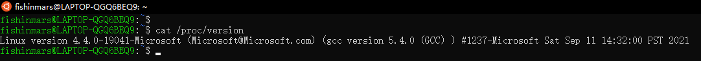
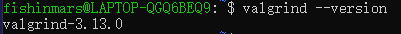

# Daily Study&Coding

---

## CSAPP - Cache Lab

### Step1 - Preparing the System

选用Windows应用商店中的Ubuntu18.04LTS



下载内存泄漏查看工具valgrind



## 2022-03-29

### Coding

#### ==Q1.Med [2024. 考试的最大困扰度](https://leetcode-cn.com/problems/maximize-the-confusion-of-an-exam)==

>一位老师正在出一场由 n 道判断题构成的考试，每道题的答案为 true （用 'T' 表示）或者 false （用 'F' 表示）。老师想增加学生对自己做出答案的不确定性，方法是 最大化 有 连续相同 结果的题数。（也就是连续出现 true 或者连续出现 false）。
>
>给你一个字符串 answerKey ，其中 answerKey[i] 是第 i 个问题的正确结果。除此以外，还给你一个整数 k ，表示你能进行以下操作的最多次数：
>
>每次操作中，将问题的正确答案改为 'T' 或者 'F' （也就是将 answerKey[i] 改为 'T' 或者 'F' ）。
>请你返回在不超过 k 次操作的情况下，最大 连续 'T' 或者 'F' 的数目。
>
>提示：
>
>n == answerKey.length
>1 <= n <= 5 * 104
>answerKey[i] 要么是 'T' ，要么是 'F'
>1 <= k <= n

只要求最大连续指定字符的数目时，本题和「1004. 最大连续1的个数 III」完全一致。

在指定字符的情况下，我们可以计算其最大连续数目。具体地，我们使用滑动窗口的方法，从左到右枚举右端点，维护区间中另一种字符的数量为 sum，当 sum 超过 k，我们需要让左端点右移，直到 sum≤k。移动过程中，我们记录滑动窗口的最大长度，即为指定字符的最大连续数目。

本题的答案为分别指定字符为 TT 和 FF 时的最大连续数目的较大值。

```c++
class Solution {
public:
    int maxConsecutiveChar(string& answerKey, int k, char ch) {
        int n = answerKey.length();
        int ans = 0;
        for (int left = 0, right = 0, sum = 0; right < n; right++) {
            sum += answerKey[right] != ch;
            while (sum > k) {
                sum -= answerKey[left++] != ch;
            }
            ans = max(ans, right - left + 1);
        }
        return ans;
    }

    int maxConsecutiveAnswers(string answerKey, int k) {
        return max(maxConsecutiveChar(answerKey, k, 'T'),
                   maxConsecutiveChar(answerKey, k, 'F'));
    }
};
```


#### Q2.Easy [剑指 Offer 03. 数组中重复的数字](https://leetcode-cn.com/problems/shu-zu-zhong-zhong-fu-de-shu-zi-lcof/)

>找出数组中重复的数字。在一个长度为 n 的数组 nums 里的所有数字都在 0～n-1 的范围内。数组中某些数字是重复的，但不知道有几个数字重复了，也不知道每个数字重复了几次。请找出数组中任意一个重复的数字。
>
>限制：
>
>2 <= n <= 100000
>
>

这道题初看是个很简单的题，第一眼就是先nlogn排序一下，然后从下标0开始遍历到n-1，每次都比较n和n+1是否相同，如果有则返回nums[n]，空间复杂度为O(1)，时间复杂度为O(nlogn)，代码块如下。

##### 排序+遍历

```c++
class Solution {
public:
    int findRepeatNumber(vector<int>& nums) {
        sort(nums.begin(), nums.end());
        for(int i = 0; i < nums.size() - 1; i++) {
             if(nums[i] == nums[i+1]) { return nums[i];}
        }
        return -1;
    }
};
```

但是看到题解中说

> 这道题在原书上绝对不是简单级别啊！
> 它考察的是程序员的沟通能力，先问面试官要时间/空间需求！！！
> 只是时间优先就用字典，
> 还有空间要求，就用指针+原地排序数组，
> 如果面试官要求空间O(1)并且不能修改原数组，还得写成二分法！！！

遂感觉十分有道理，所以将另外的也写出。

##### HashMap 

空间复杂度为O(n)，时间复杂度为O(n)，代码块如下。

```c++
    int findRepeatNumber(vector<int>& nums) {
        unordered_map<int,int> mp;
        for(int i=0;i<nums.size();i++){
            if(mp.find(nums[i]) != mp.end()) return nums[i];
            else mp[nums[i]] ++;
        }
        return -1;
    }
```

##### 鸽巢原理

因为出现的元素值 < nums.size(); 所以我们可以将见到的元素 放到索引的位置，如果交换时，发现索引处已存在该元素，则重复 O(N) 空间O(1)

```c++
    int findRepeatNumber(vector<int>& nums) {
        for(int i=0;i<nums.size();i++){
            while(nums[i]!=i){
                if(nums[nums[i]] == nums[i]) return nums[i];
                int tmp = nums[i];
                nums[i] = nums[tmp];
                nums[tmp] = tmp;
            }
        }
        return -1;
    }
```

#### Q3.Med [剑指 Offer 04. 二维数组中的查找](https://leetcode-cn.com/problems/er-wei-shu-zu-zhong-de-cha-zhao-lcof)

> 在一个 n * m 的二维数组中，每一行都按照从左到右递增的顺序排序，每一列都按照从上到下递增的顺序排序。请完成一个高效的函数，输入这样的一个二维数组和一个整数，判断数组中是否含有该整数。
>
> 限制：
>
> 0 <= n <= 1000
> 0 <= m <= 1000

```c++
class Solution {
public:
    bool findNumberIn2DArray(vector<vector<int>>& matrix, int target) {
        int i = matrix.size() - 1, j = 0;
        while (i >= 0 && j < matrix[0].size()) {
            if (matrix[i][j] > target) i--;
            else if (matrix[i][j] < target) j++;
            else return true;
        }
        return false;
    }
};
```

- 从矩阵左下角遍历到右上角，并与目标值对比
- 当 matrix[i] [j] > target 时： 行下标向上移动一行（i--），即消去矩阵第 i 行数字；
- 当 matrix[i] [j] < target 时： 列下标向右移动一列（j++），即消去矩阵第 j 列数字；
- 当 matrix[i] [j] == target 时： 返回 true。
- 如果越界，则返回 false

### Studing

#### 系统结构作业（第三次）

PS.得再好好看一遍流水线了

#### HashMap & HashSet

##### 什么是HashSet

HashSet实现了Set接口，它不允许集合中有重复的值，当我们提到HashSet时，第一件事情就是在将对象存储在HashSet之前，要先确保对象重写equals()和hashCode()方法，这样才能比较对象的值是否相等，以确保set中没有储存相等的对象。如果我们没有重写这两个方法，将会使用这个方法的默认实现。

public boolean add(Object o)方法用来在Set中添加元素，当元素值重复时则会立即返回false，如果成功添加的话会返回true。

##### 什么是HashMap

HashMap实现了Map接口，Map接口对键值对进行映射。Map中不允许重复的键。Map接口有两个基本的实现，HashMap和TreeMap。TreeMap保存了对象的排列次序，而HashMap则不能。HashMap允许键和值为null。HashMap是非synchronized的，但collection框架提供方法能保证HashMap synchronized，这样多个线程同时访问HashMap时，能保证只有一个线程更改Map。

public Object put(Object Key,Object value)方法用来将元素添加到map中。

你可以阅读[这篇文章](http://www.importnew.com/7099.html)看看HashMap的工作原理，以及[这篇文章](http://www.importnew.com/7010.html)看看HashMap和HashTable的区别。

##### HashSet和HashMap的区别

| HashMap                                     | HashSet                                                      |
| ------------------------------------------- | ------------------------------------------------------------ |
| HashMap实现了Map接口                        | HashSet实现了Set接口                                         |
| HashMap储存键值对                           | HashSet仅仅存储对象                                          |
| 使用put()方法将元素放入map中                | 使用add()方法将元素放入set中                                 |
| HashMap中使用键对象来计算hashcode值         | HashSet使用成员对象来计算hashcode值，对于两个对象来说hashcode可能相同，所以equals()方法用来判断对象的相等性，如果两个对象不同的话，那么返回false |
| HashMap比较快，因为是使用唯一的键来获取对象 | HashSet较HashMap来说比较慢                                   |


