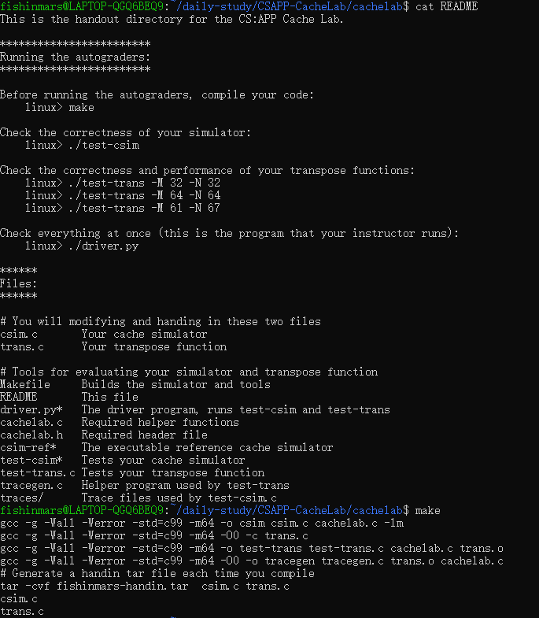

[TOC]

# Daily Study&Coding

---

## FP - Labs

### Lab1 

#### Step1.环境准备

```
sudo apt install ~~~
```


在安装好环境后编写HelloWorld进行测试


#### Step2. Lab1

##### Q1


左侧列内容


右侧列内容


##### Q2


```
fun multx ([ ], a) = a
  | multx (x :: L, a) = multx (L, x * a);

fun Multx ([ ], a) = a
  | Multx (r :: R, a) = Mult (R) * mult' (r, a);
```

##### Q3


```
fun Mult [ ] = 1 
  | Mult (r :: R) = mult(r) * Mult(R);
```

##### Q4


```
fun multx ([ ], a) = a
  | multx (x :: L, a) = multx (L, x * a);

fun Multx ([ ], a) = a
  | Multx (r :: R, a) = Mult (R) * mult' (r, a);
```

##### Q5


```
fun double(0 : int) : int = 0
  | double n = 2 + double(n - 1);

fun square(0 : int) : int = 0
  | square(x) = square(x - 1) + double(x - 1) + 1;
```

##### Q6


```
fun zip([]:string list,[]:int list):(string*int)list=[]
 | zip ([]:string list,L:int list):(string*int)list=[]
 | zip (L:string list,[]:int list):(string*int)list=[]
 | zip (str::SL,num::NL)=(str,num)::zip(SL,NL);

fun unzip([]:(string*int)list):((string list)*(int list))=([],[])
 | unzip ((str,num)::L)=let val (sl,nl)=unzip(L) in (str::sl,num::nl) end;
```


## CSAPP - Cache Lab

### Step1 - Preparing the System(2022-03-29)

选用Windows应用商店中的Ubuntu18.04LTS


下载内存泄漏查看工具valgrind


使用svn下载CSAPP-CacheLab


根据README，使用make进行初始化build



### Step2 - PartA Cache Simulator

#### 参数含义

```
Usage: ./csim [-hv] -s <s> -E <E> -b <b> -t <tracefile>   
```

①-h：输出帮助信息的选项；
②-v：输出详细运行过程信息的选项；
③-s：组索引的位数(意味着组数S=2^s^)；
④-E：每一组包含的行数；
⑤-b：偏移位的宽度(意味着块的大小为B=2^b^);
⑥-t：输入数据文件的路径(测试数据从该文件里面读取)。

#### trace file构成

*.trace文件中的指令格式为operation,address,Size,具体内容如下 ：

operation 中：
“I”表示指令加载，(由于本实验仅关心数据Cache的性能，因此模拟器应忽略所有指令cache访问（即轨迹中“I”起始的行）)。
“L”表示数据加载，（L我们可以简单的认为对某一个地址寄存器的访问）。
“S”表示数据存储，（S简单的认为对寄存器的访问）。
“M”表示数据修改（即数据存储之后的数据加载）。
每个“I”前面都没有空格。每个“M”，“L”和“S”之前总是有空格。

address 指定一个32位的十六进制存储器地址。

Size 指定操作访问的字节数。

#### 需要用到的函数

##### getopt()

getopt（）函数可以在缺失函数声明时，自动分析unix命令行中的元素。通常在循环中调用来检索参数，它的返回值存储在一个局部变量中。当函数返回-1时，没有操作。推荐使用getopt函数来进行命令行分析，使用函数时需要包含`#include <unistd.h>`头文件。函数使用的案例如下：  

```c++
int main(int argc, char** argv){  
  int opt,x,y;  
  /* 循环参数 */  
  while(-1 != (opt = getopt(argc, argv, "x:y:"))){  
      /* 确定正在处理的参数 */  
      switch(opt) {  
          case 'x':  
              x = atoi(optarg);  
              break;  
          case 'y':  
              y = atoi(optarg);  
              break;  
          default:  
              printf("wrong argument\n");  
              break;  
      }   
  }  
}  
```

##### fscanf()

fscanf()函数与scanf()一样，只是它可以指定要从中读取的流（scanf总是从stdin中读取）。  

```c++
FILE * pFile; //文件对象  
pFile = fopen ("tracefile.txt",“r"); //打开读取的文件  
char identifier;  
unsigned address;  
int size;  
// 例如读取行 " M 20,1" or "L 19,3"  
while(fscanf(pFile,“ %c %x,%d”, &identifier, &address, &size)>0)  
{  
  // 相关操作  
}  
fclose(pFile); //记得完成后close文件  
```

##### malloc /  free 内存

使用malloc在堆上分配内存，free释放内存，实例如下：  

```c++
some_pointer_you_malloced = malloc(sizeof(int));  
Free(some_pointer_you_malloced);  
```

#### Cache的构成

cache有2^s组，每组有E行（E分为三种情况：E=1，称为直接映射高速缓存；1<E<C/B:组相联高速缓存；E=C/B，全相连高速缓存，也就是一组包含了所有的行），然后是每行的构成：

（1）有效位vild(取0和1，1表示存储了有效信息，0表示没有，判断命中的时候需要用到）

（2）标记位t=m-(s+b),当cpu要读取某个地址的内容时，就会将某个地址的第一个部分：标记位与它进行对比，匹配相等则命中，也就是锁定在某一行

（3）数据块B，B负责存储这个地址的内容，把B想象成字节数组就好，共有B-1个小块（别和B这个数据块搞混咯,下标从0开始，因此是B-1）。

#### Coding

##### 变量

```c++
int h,v,s,E,b,S; // 这个是我们模拟的参数，为了方便在函数里调用，设置成全局

int hit_count , 
    miss_count , 
    eviction_count;  // 三个在 printSummary 函数中的参数，需要不断更新
	
char t[1000]; // 存 getopt 中选项内容，表示的是验证中需使用的trace文件名

typedef struct{
    int valid_bits;
    int tag;
    int stamp;
}cache_line, *cache_asso, **cache;  // cache 模拟器的结构。由合法位、标记位和时间戳组成

cache _cache_ = NULL;  // 声明一个空的结构体类型二维数组
```

##### 帮助信息

```c++
void printUsage()
{
    printf("Usage: ./csim-ref [-hv] -s <num> -E <num> -b <num> -t <file>\n"
            "Options:\n"
            "  -h         Print this help message.\n"
            "  -v         Optional verbose flag.\n"
            "  -s <num>   Number of set index bits.\n"
            "  -E <num>   Number of lines per set.\n"
            "  -b <num>   Number of block offset bits.\n"
            "  -t <file>  Trace file.\n\n"
            "Examples:\n"
            "  linux>  ./csim-ref -s 4 -E 1 -b 4 -t traces/yi.trace\n"
            "  linux>  ./csim-ref -v -s 8 -E 2 -b 4 -t traces/yi.trace\n");
}
```

##### 初始化Cache

```c++
void init_cache()
{
	//多维数组的开辟要一行行malloc
        _cache_ = (cache)malloc(sizeof(cache_asso) * S); 
	for(int i = 0; i < S; ++i)
	{
		_cache_[i] = (cache_asso)malloc(sizeof(cache_line) * E);
		for(int j = 0; j < E; ++j)
		{
			_cache_[i][j].valid_bits = 0;
			_cache_[i][j].tag = -1;
			_cache_[i][j].stamp = -1;
		}
	}
}
```

##### 更新Cache

```c++
void updateCache(unsigned int address)
{
	// 索引地址位可以用位运算，-1U是最大整数，64是因为我电脑是64位
    int setindex_add = (address >> b) & ((-1U) >> (64 - s));
	int tag_add = address >> (b + s);
	
	int max_stamp = INT_MIN;
	int max_stamp_index = -1;

	for(int i = 0; i < E; ++i) //如果tag相同，就hit，重置时间戳
	{
		if(_cache_[setindex_add][i].tag == tag_add)
		{
			_cache_[setindex_add][i].stamp = 0;
			++hit_count;
			return ;
		}
	}
	
	for(int i = 0; i < E; ++i) // 查看有没有空行
	{
		if(_cache_[setindex_add][i].valid_bits == 0)
		{
			_cache_[setindex_add][i].valid_bits = 1;
			_cache_[setindex_add][i].tag = tag_add;
			_cache_[setindex_add][i].stamp = 0;
			++miss_count;
			return ;
		}
	}
	// 没有空行又没有hit就是要替换了
	++eviction_count;
	++miss_count;
	
	for(int i = 0; i < E; ++i)
	{
		if(_cache_[setindex_add][i].stamp > max_stamp)
		{
			max_stamp = _cache_[setindex_add][i].stamp;
			max_stamp_index = i;
		}
	}
	_cache_[setindex_add][max_stamp_index].tag = tag_add;
	_cache_[setindex_add][max_stamp_index].stamp = 0;
	return ;
}

void update_stamp()
{
	for(int i = 0; i < S; ++i)
		for(int j = 0; j < E; ++j)
			if(_cache_[i][j].valid_bits == 1)
				++_cache_[i][j].stamp;
}
```

##### 解析.trace文件

```c++
void parse_trace()
{
	FILE* fp = fopen(t, "r"); // 读取文件名
	if(fp == NULL)
	{
		printf("open error");
		exit(-1);
	}
	
	char operation;         // 命令开头的 I L M S
	unsigned int address;   // 地址参数
	int size;               // 大小
	while(fscanf(fp, " %c %xu,%d\n", &operation, &address, &size) > 0)
	{
		
		switch(operation)
		{
			//case 'I': continue;	   // 不用写关于 I 的判断也可以
			case 'L':
				updateCache(address);
				break;
			case 'M':
				updateCache(address);  // miss的话还要进行一次storage
			case 'S':
				updateCache(address);
		}
		update_stamp();	//更新时间戳
	}
	
	fclose(fp);
	for(int i = 0; i < S; ++i)
		free(_cache_[i]);
	free(_cache_);            // malloc 完要记得 free 并且关文件
	
}
```

##### main函数

```c++
int main(int argc, char* argv[])
{
	h = 0; 
	v = 0; 
	hit_count = miss_count = eviction_count = 0;
	int opt; // 接收getopt的返回值
        
        // getopt 第三个参数中，不可省略的选项字符后要跟冒号，这里h和v可省略
	while(-1 != (opt = (getopt(argc, argv, "hvs:E:b:t:"))))
	{
		switch(opt)
		{
			case 'h':
				h = 1;
				printUsage();
				break;
			case 'v':
				v = 1;
				printUsage();
				break;
			case 's':
				s = atoi(optarg);
				break;
			case 'E':
				E = atoi(optarg);
				break;
			case 'b':
				b = atoi(optarg);
				break;
			case 't':
				strcpy(t, optarg);
				break;
			default:
				printUsage();
				break;
		}
	}
	
	if(s<=0 || E<=0 || b<=0 || t==NULL) // 如果选项参数不合格就退出
	        return -1;
	S = 1 << s;                // S=2^s
	
	FILE* fp = fopen(t, "r");
	if(fp == NULL)
	{
		printf("open error");
		exit(-1);
	}
	
	init_cache();  // 初始化cache
	parse_trace(); // 更新最终的三个参数

    printSummary(hit_count, miss_count, eviction_count);
    
    return 0;
}
```

#### 结果展示

```bash
$ make clean
$ make
$ ./test-csim
```


### Step3 - PartB  Matrix Trans

#### 任务

在trans.c中使用C语言编写一个实现矩阵转置的函数transpose_submit。即对于给定的矩阵`Am×n`，得到矩阵`Bn×m`，使得对于任意`0<=i<n、0<=j<m,有B[j][i]=A[i][j]`，其并且使函数调用过程中对cache的不命中数miss尽可能少。

#### 要求

限制对栈的引用——在转置函数中最多定义和使用==12个int类型的局部变量==，同时不能使用任何long类型的变量或其他位模式数据以在一个变量中存储多个值。原因：实验测试代码不能/不应计数栈的引用访问，而应将注意力集中在对源和目的矩阵的访问模式上。

不允许使用递归。如果定义和调用辅助函数，在任意时刻，从转置函数的栈帧到辅助函数的栈帧之间最多可以同时存在12个局部变量。例如，如果转置函数定义了8个局部变量，其中调用了一个使用4个局部变量的函数，而其进一步调用了一个使用2个局部变量的函数，则栈上总共将有14个变量，则违反了本规则。

转置函数不允许改变矩阵A，但可以任意操作矩阵B。

不允许在代码中定义任何矩阵或使用malloc及其变种。

#### Coding

##### 32 x 32 Matrix

>cache存下8行，所以分割为8*8的矩阵块。那么8 *8矩阵块在cache里面恰好没有冲突。miss最小。

直接如题干提醒所示，Cache分8块，最大限度利用Cache，代码如下：

```c++
if (M == 32)
    {
        int i, j, k, v1, v2, v3, v4, v5, v6, v7, v8;
        for (i = 0; i < 32; i += 8)
            for (j = 0; j < 32; j += 8)
                for (k = i; k < (i + 8); ++k)
                {
                    v1 = A[k][j];
                    v2 = A[k][j + 1];
                    v3 = A[k][j + 2];
                    v4 = A[k][j + 3];
                    v5 = A[k][j + 4];
                    v6 = A[k][j + 5];
                    v7 = A[k][j + 6];
                    v8 = A[k][j + 7];
                    B[j][k] = v1;
                    B[j + 1][k] = v2;
                    B[j + 2][k] = v3;
                    B[j + 3][k] = v4;
                    B[j + 4][k] = v5;
                    B[j + 5][k] = v6;
                    B[j + 6][k] = v7;
                    B[j + 7][k] = v8;
                }
    }
```


##### 64 x 64 Matrix

>首先本题没有32 *32那么明显，但是题目要求不可以更改矩阵A的值，但是你可以对矩阵B做任何你喜欢的事情。所以可以利用B已经加载进来的部分存数据而不引起新的miss。首先读入A11，A12,以后我们把A12转置存进B12而非B21，这样就不会造成额外cold rate了，B暂时cold rate=1/4，请注意下面我们先读A21，把它的值往B12写，这之前把B12读出来往B21写，按行写，这样一来我们虽然造成了B的最后一个cold rate，但是这个不是浪费，因为为了B21,B22，迟早要加载进来，接下来再写B22就不必加载了。所以B的cold miss只有2/4，这样性能就达到了题目要求。

 当矩阵规模增到到64x64的时候，由于矩阵规模比较大，无法在cache的一行全部加载矩阵的一行，还是先分成8x8的块。我处理是思路是这样的：每次处理一个块，也就是像32x32那样取出每行的8个元素，然后将 每行的0-3号元素正常的放到B[0-3][0]这些位置去（也就是正常的转置),剩下的四个元先放置B矩阵4x4块的最右边保存，注意这个时候我已经取出来了。然后再用一个循环去把这些值放到B正确的位置去，然后A[4]到A[7]也是上述的处理。对整个矩阵重复这个操作即可。代码如下:

```c++
 else if (M == 64)
    {
        int i, j, k, l;
        int v1, v2, v3, v4, v5, v6, v7, v8;
        for (i = 0; i < N; i += 8)
            for (j = 0; j < M; j += 8)
            {
                for (k = i; k < i + 4; ++k)
                {
                    v1 = A[k][j];
                    v2 = A[k][j + 1];
                    v3 = A[k][j + 2];
                    v4 = A[k][j + 3];
                    v5 = A[k][j + 4];
                    v6 = A[k][j + 5];
                    v7 = A[k][j + 6];
                    v8 = A[k][j + 7];

                    B[j][k] = v1;
                    B[j + 1][k] = v2;
                    B[j + 2][k] = v3;
                    B[j + 3][k] = v4;
                    B[j][k + 4] = v5;
                    B[j + 1][k + 4] = v6;
                    B[j + 2][k + 4] = v7;
                    B[j + 3][k + 4] = v8;
                }
                for (l = j; l < j + 4; ++l)
                {
                    v1 = A[i + 4][l];
                    v2 = A[i + 5][l];
                    v3 = A[i + 6][l];
                    v4 = A[i + 7][l];
                    v5 = B[l][i + 4];
                    v6 = B[l][i + 5];
                    v7 = B[l][i + 6];
                    v8 = B[l][i + 7];

                    B[l][i + 4] = v1;
                    B[l][i + 5] = v2;
                    B[l][i + 6] = v3;
                    B[l][i + 7] = v4;
                    B[l + 4][i] = v5;
                    B[l + 4][i + 1] = v6;
                    B[l + 4][i + 2] = v7;
                    B[l + 4][i + 3] = v8;
                }
                for (k = i + 4; k < i + 8; ++k)
                {
                    v1 = A[k][j + 4];
                    v2 = A[k][j + 5];
                    v3 = A[k][j + 6];
                    v4 = A[k][j + 7];
                    B[j + 4][k] = v1;
                    B[j + 5][k] = v2;
                    B[j + 6][k] = v3;
                    B[j + 7][k] = v4;
                }
            }
    }
```

##### 67 x 61 Matrix

>也是分块，要找出一个比较优的策略还是比较难的，需要多次分析和尝试。

测试之后，17分块是最优解，代码如下：

```
    else if (M == 61)
    {
        int i, j, k, l;
        int v1;
        for(i = 0; i < 61; i += 17) {
            for(j = 0; j < 67; j += 17) {
                for (k = j; k < j + 17 && k < 67; ++k) {
                    for(l = i; l < i + 17 && l < 61; ++l) {
                        v1 = A[k][l];
                        B[l][k]=v1;
                    }
                }
            }
        }
    }
```


### Step4 - Final Test


## 2022-03-29

### Code

#### Q1.Med [2024. 考试的最大困扰度](https://leetcode-cn.com/problems/maximize-the-confusion-of-an-exam)

>一位老师正在出一场由 n 道判断题构成的考试，每道题的答案为 true （用 'T' 表示）或者 false （用 'F' 表示）。老师想增加学生对自己做出答案的不确定性，方法是 最大化 有 连续相同 结果的题数。（也就是连续出现 true 或者连续出现 false）。
>
>给你一个字符串 answerKey ，其中 answerKey[i] 是第 i 个问题的正确结果。除此以外，还给你一个整数 k ，表示你能进行以下操作的最多次数：
>
>每次操作中，将问题的正确答案改为 'T' 或者 'F' （也就是将 answerKey[i] 改为 'T' 或者 'F' ）。
>请你返回在不超过 k 次操作的情况下，最大 连续 'T' 或者 'F' 的数目。
>
>提示：
>
>n == answerKey.length
>1 <= n <= 5 * 104
>answerKey[i] 要么是 'T' ，要么是 'F'
>1 <= k <= n

只要求最大连续指定字符的数目时，本题和「1004. 最大连续1的个数 III」完全一致。

在指定字符的情况下，我们可以计算其最大连续数目。具体地，我们使用滑动窗口的方法，从左到右枚举右端点，维护区间中另一种字符的数量为 sum，当 sum 超过 k，我们需要让左端点右移，直到 sum≤k。移动过程中，我们记录滑动窗口的最大长度，即为指定字符的最大连续数目。

本题的答案为分别指定字符为 TT 和 FF 时的最大连续数目的较大值。

##### 滑动窗口

```c++
class Solution {
public:
    int maxConsecutiveChar(string& answerKey, int k, char ch) {
        int n = answerKey.length();
        int ans = 0;
        for (int left = 0, right = 0, sum = 0; right < n; right++) {
            sum += answerKey[right] != ch;
            while (sum > k) {
                sum -= answerKey[left++] != ch;
            }
            ans = max(ans, right - left + 1);
        }
        return ans;
    }

    int maxConsecutiveAnswers(string answerKey, int k) {
        return max(maxConsecutiveChar(answerKey, k, 'T'),
                   maxConsecutiveChar(answerKey, k, 'F'));
    }
};
```


#### Q2.Easy [剑指 Offer 03. 数组中重复的数字](https://leetcode-cn.com/problems/shu-zu-zhong-zhong-fu-de-shu-zi-lcof/)

>找出数组中重复的数字。在一个长度为 n 的数组 nums 里的所有数字都在 0～n-1 的范围内。数组中某些数字是重复的，但不知道有几个数字重复了，也不知道每个数字重复了几次。请找出数组中任意一个重复的数字。
>
>限制：
>
>2 <= n <= 100000
>
>

这道题初看是个很简单的题，第一眼就是先nlogn排序一下，然后从下标0开始遍历到n-1，每次都比较n和n+1是否相同，如果有则返回nums[n]，空间复杂度为O(1)，时间复杂度为O(nlogn)，代码块如下。

##### 排序+遍历

```c++
class Solution {
public:
    int findRepeatNumber(vector<int>& nums) {
        sort(nums.begin(), nums.end());
        for(int i = 0; i < nums.size() - 1; i++) {
             if(nums[i] == nums[i+1]) { return nums[i];}
        }
        return -1;
    }
};
```

但是看到题解中说

> 这道题在原书上绝对不是简单级别啊！
> 它考察的是程序员的沟通能力，先问面试官要时间/空间需求！！！
> 只是时间优先就用字典，
> 还有空间要求，就用指针+原地排序数组，
> 如果面试官要求空间O(1)并且不能修改原数组，还得写成二分法！！！

遂感觉十分有道理，所以将另外的也写出。

##### HashMap 

空间复杂度为O(n)，时间复杂度为O(n)，代码块如下。

```c++
    int findRepeatNumber(vector<int>& nums) {
        unordered_map<int,int> mp;
        for(int i=0;i<nums.size();i++){
            if(mp.find(nums[i]) != mp.end()) return nums[i];
            else mp[nums[i]] ++;
        }
        return -1;
    }
```

##### 鸽巢原理

因为出现的元素值 < nums.size(); 所以我们可以将见到的元素 放到索引的位置，如果交换时，发现索引处已存在该元素，则重复 O(N) 空间O(1)

```c++
    int findRepeatNumber(vector<int>& nums) {
        for(int i=0;i<nums.size();i++){
            while(nums[i]!=i){
                if(nums[nums[i]] == nums[i]) return nums[i];
                int tmp = nums[i];
                nums[i] = nums[tmp];
                nums[tmp] = tmp;
            }
        }
        return -1;
    }
```

#### Q3.Med [剑指 Offer 04. 二维数组中的查找](https://leetcode-cn.com/problems/er-wei-shu-zu-zhong-de-cha-zhao-lcof)

> 在一个 n * m 的二维数组中，每一行都按照从左到右递增的顺序排序，每一列都按照从上到下递增的顺序排序。请完成一个高效的函数，输入这样的一个二维数组和一个整数，判断数组中是否含有该整数。
>
> 限制：
>
> 0 <= n <= 1000
> 0 <= m <= 1000

```c++
class Solution {
public:
    bool findNumberIn2DArray(vector<vector<int>>& matrix, int target) {
        int i = matrix.size() - 1, j = 0;
        while (i >= 0 && j < matrix[0].size()) {
            if (matrix[i][j] > target) i--;
            else if (matrix[i][j] < target) j++;
            else return true;
        }
        return false;
    }
};
```

- 从矩阵左下角遍历到右上角，并与目标值对比
- 当 matrix[i] [j] > target 时： 行下标向上移动一行（i--），即消去矩阵第 i 行数字；
- 当 matrix[i] [j] < target 时： 列下标向右移动一列（j++），即消去矩阵第 j 列数字；
- 当 matrix[i] [j] == target 时： 返回 true。
- 如果越界，则返回 false

### Study

#### 系统结构作业（第三次）

PS.得再好好看一遍流水线了

#### HashMap & HashSet

##### 什么是HashSet

HashSet实现了Set接口，它不允许集合中有重复的值，当我们提到HashSet时，第一件事情就是在将对象存储在HashSet之前，要先确保对象重写equals()和hashCode()方法，这样才能比较对象的值是否相等，以确保set中没有储存相等的对象。如果我们没有重写这两个方法，将会使用这个方法的默认实现。

public boolean add(Object o)方法用来在Set中添加元素，当元素值重复时则会立即返回false，如果成功添加的话会返回true。

##### 什么是HashMap

HashMap实现了Map接口，Map接口对键值对进行映射。Map中不允许重复的键。Map接口有两个基本的实现，HashMap和TreeMap。TreeMap保存了对象的排列次序，而HashMap则不能。HashMap允许键和值为null。HashMap是非synchronized的，但collection框架提供方法能保证HashMap synchronized，这样多个线程同时访问HashMap时，能保证只有一个线程更改Map。

public Object put(Object Key,Object value)方法用来将元素添加到map中。

你可以阅读[这篇文章](http://www.importnew.com/7099.html)看看HashMap的工作原理，以及[这篇文章](http://www.importnew.com/7010.html)看看HashMap和HashTable的区别。

##### HashSet和HashMap的区别

| HashMap                                     | HashSet                                                      |
| ------------------------------------------- | ------------------------------------------------------------ |
| HashMap实现了Map接口                        | HashSet实现了Set接口                                         |
| HashMap储存键值对                           | HashSet仅仅存储对象                                          |
| 使用put()方法将元素放入map中                | 使用add()方法将元素放入set中                                 |
| HashMap中使用键对象来计算hashcode值         | HashSet使用成员对象来计算hashcode值，对于两个对象来说hashcode可能相同，所以equals()方法用来判断对象的相等性，如果两个对象不同的话，那么返回false |
| HashMap比较快，因为是使用唯一的键来获取对象 | HashSet较HashMap来说比较慢                                   |

## 2022-03-30

### Code

#### Q1. Hard [1606. 找到处理最多请求的服务器](https://leetcode-cn.com/problems/find-servers-that-handled-most-number-of-requests)（寄）

>你有 k 个服务器，编号为 0 到 k-1 ，它们可以同时处理多个请求组。每个服务器有无穷的计算能力但是 不能同时处理超过一个请求 。请求分配到服务器的规则如下：
>
>第 i （序号从 0 开始）个请求到达。
>如果所有服务器都已被占据，那么该请求被舍弃（完全不处理）。
>如果第 (i % k) 个服务器空闲，那么对应服务器会处理该请求。
>否则，将请求安排给下一个空闲的服务器（服务器构成一个环，必要的话可能从第 0 个服务器开始继续找下一个空闲的服务器）。比方说，如果第 i 个服务器在忙，那么会查看第 (i+1) 个服务器，第 (i+2) 个服务器等等。
>给你一个 严格递增 的正整数数组 arrival ，表示第 i 个任务的到达时间，和另一个数组 load ，其中 load[i] 表示第 i 个请求的工作量（也就是服务器完成它所需要的时间）。你的任务是找到 最繁忙的服务器 。最繁忙定义为一个服务器处理的请求数是所有服务器里最多的。

#### Q2. Med [11. 盛最多水的容器](https://leetcode-cn.com/problems/container-with-most-water)

>给定一个长度为 n 的整数数组 height 。有 n 条垂线，第 i 条线的两个端点是 (i, 0) 和 (i, height[i]) 。
>
>找出其中的两条线，使得它们与 x 轴共同构成的容器可以容纳最多的水。
>
>返回容器可以储存的最大水量。
>
>说明：你不能倾斜容器。

##### 双指针~

```c++
class Solution {
public:
    int maxArea(vector<int>& height) {
        int l = 0, r = height.size() - 1;
        int ans = 0;
        while (l < r) {
            int area = min(height[l], height[r]) * (r - l);
            ans = max(ans, area);
            if (height[l] <= height[r]) {
                ++l;
            }
            else {
                --r;
            }
        }
        return ans;
    }
};
```

#### Q3. Med [122. 买卖股票的最佳时机 II](https://leetcode-cn.com/problems/best-time-to-buy-and-sell-stock-ii)

>给定一个数组 prices ，其中 prices[i] 表示股票第 i 天的价格。
>
>在每一天，你可能会决定购买和/或出售股票。你在任何时候 最多 只能持有 一股 股票。你也可以购买它，然后在 同一天 出售。
>返回 你能获得的 最大 利润 。

##### 贪心

```c++
class Solution {
public:
    int maxProfit(vector<int>& prices) {   
        int ans = 0;
        int n = prices.size();
        for (int i = 1; i < n; ++i) {
            ans += max(0, prices[i] - prices[i - 1]);
        }
        return ans;
    }
};
```

#### Q4.Med [134. 加油站](https://leetcode-cn.com/problems/gas-station)

>在一条环路上有 n 个加油站，其中第 i 个加油站有汽油 gas[i] 升。
>
>你有一辆油箱容量无限的的汽车，从第 i 个加油站开往第 i+1 个加油站需要消耗汽油 cost[i] 升。你从其中的一个加油站出发，开始时油箱为空。
>
>给定两个整数数组 gas 和 cost ，如果你可以绕环路行驶一周，则返回出发时加油站的编号，否则返回 -1 。如果存在解，则 保证 它是 唯一 的。
>

##### 一次遍历

一次遍历法，车能开完全程需要满足两个条件：

- 车从`i`站能开到`i+1`。
- 所有站里的油总量要`>=`车子的总耗油量。

那么，假设从编号为0站开始，一直到`k`站都正常，在开往`k+1`站时车子没油了。这时，应该将起点设置为`k+1`站。

```c++
class Solution {
public:
    int canCompleteCircuit(vector<int>& gas, vector<int>& cost) {
        int rest = 0, run = 0, start = 0;
        for (int i = 0; i < gas.size(); ++i){
            run += (gas[i] - cost[i]);
            rest += (gas[i] - cost[i]);
            if (run < 0){
                start = i + 1;
                run = 0;
            }
        }
        return rest < 0 ? -1: start;
    }
};
```

#### Q5.Hard [135. 分发糖果](https://leetcode-cn.com/problems/candy)

>n 个孩子站成一排。给你一个整数数组 ratings 表示每个孩子的评分。
>
>你需要按照以下要求，给这些孩子分发糖果：
>
>每个孩子至少分配到 1 个糖果。
>相邻两个孩子评分更高的孩子会获得更多的糖果。
>请你给每个孩子分发糖果，计算并返回需要准备的 最少糖果数目 。

##### 常数空间遍历

如果当前同学比上一个同学评分高，说明我们就在最近的递增序列中，直接分配给该同学 \textit{pre} + 1pre+1 个糖果即可。

否则我们就在一个递减序列中，我们直接分配给当前同学一个糖果，并把该同学所在的递减序列中所有的同学都再多分配一个糖果，以保证糖果数量还是满足条件。

我们无需显式地额外分配糖果，只需要记录当前的递减序列长度，即可知道需要额外分配的糖果数量。

同时注意当当前的递减序列长度和上一个递增序列等长时，需要把最近的递增序列的最后一个同学也并进递减序列中。

这样，我们只要记录当前递减序列的长度 dec，最近的递增序列的长度 \textit{inc}inc 和前一个同学分得的糖果数量pre 即可。

```c++
class Solution {
public:
    int candy(vector<int>& ratings) {
        int n = ratings.size();
        int ret = 1;
        int inc = 1, dec = 0, pre = 1;
        for (int i = 1; i < n; i++) {
            if (ratings[i] >= ratings[i - 1]) {
                dec = 0;
                pre = ratings[i] == ratings[i - 1] ? 1 : pre + 1;
                ret += pre;
                inc = pre;
            } else {
                dec++;
                if (dec == inc) {
                    dec++;
                }
                ret += dec;
                pre = 1;
            }
        }
        return ret;
    }
};
```

### Study

#### FP - 函数式编程

##### ML标准类型

| 类型                  | 实例                          |
| --------------------- | ----------------------------- |
| 基础类型(basic types) | unit, int, real, bool, string |
| 表(lists)             | int list, (int -> int) list   |
| 元组(tuples)          | int * int, int * int * real   |
| 函数(functions)       | int -> int, real -> int * int |

###### 基础类型(basic types) 

- 单元(unit) 只包含一个元素，用空的括号表示( ) : unit
- 整型(int) 负号用“~”表示
- 浮点型(real)
- 布尔型(bool) true, false
- 字符串型(string) 双引号间的字符序列

###### 表(lists) 

- 包含相同类型元素的有限序列
- 表中元素用“,”分隔，整个表用[ ]括起来
- 元素可以重复出现，其顺序有意义
- 表的类型取决于表中元素类型（可以为任意类型，但需具有相同的类型）
- 表可以嵌套
- 表的基本函数：
  :: (追加元素), @ (连接表), null (空表测试), hd(返回表头元素), 
  tl(返回非空表的表尾), length(返回表长)

> nil = [ ] (空表) [ ] : int list, [ ] : bool list, ......
> [1, 3, 2, 1, 21+21] : int list
> [true, false, true] : bool list
> [[1],[2, 3]] : (int list) list
> 1::[2, 3] = [1, 2, 3]
> [1, 2]@[3, 4] = [1, 2, 3, 4]

###### 元组(tuples) 

- 包含任意类型数据元素的定长序列
- 类型表达式：每个元素的类型用*间隔并排列在一起如： int * int, int * int * real
- 圆括号中用逗号分隔的数据元素，允许嵌套如: (“张三”, “男”, 19, 1.75)

> [((“赵”,”子昂”)，21, 1.81), ((“张”, “文艺”), 20, 1.69)]
> ((string * string) * int * real) list

###### 记录(record) 

- 类似C中的结构类型，可以包含不同类型的元素
- 每个元素都有一个名字
- 记录的值和类型的写法都用{ }括起来如： {First_name=“赵”, Last_name=“子昂”}

###### 函数(functions) 

- 以一定的规则将定义域上的值映射到值域上去
- 类型由它的定义域类型和值域类型共同描述
- ->表示定义域到值域的映射
- ​        fn: <定义域类型> -> <值域类型> 如: fun add(x, y) = x + y;

###### 元组、列表、记录的异同点

| 方面     | 元组     | 列表     | 记录     |
| -------- | -------- | -------- | -------- |
| 符号     | ( )      | [ ]      | { }      |
| 元素类型 | 可以不同 | 必须相同 | 可以不同 |
| 长度     | 定长     | 变长     | 变长     |

##### 声明(Declarations)

赋予某个对象一个名字，包括值、类型、签名、结构和函子

###### 函数的声明：

- fun <函数名> (<形式参数>) : <结果类型> = <函数体>
- 例：fun divmod(x:int, y:int) : int*int = (x div y, x mod y)

###### 值的声明：

- val pi = 3.1415；
- val (q:int, r:int) = divmod(42, 5)；
- 采用静态绑定方式——重新声明不会损坏系统、库或程序

##### 模式匹配

###### 模式匹配举例：eval

>**fun** eval ([ ]:int list):int = 0
>
>| eval (d::L) = d + 10 * (eval L);

eval [2,4] =>* [d:2, L:[4]] (d + 10 * (eval L))
				=>* 2 + 10 * (eval [4])
				=>* 2 + 10 * (4 + 10 * (eval [ ]))
				=>* 2 + 10 * (4 + 10 * 0)
				=>* 2 + 10 * 4
				=>* 42
